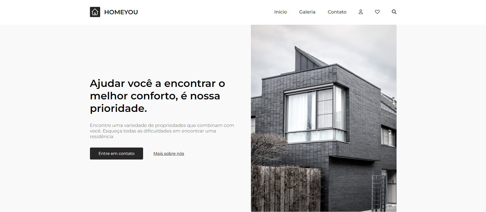

# 🏠 HOMEYOU

Encontre uma variedade de propriedades que combinam com você. Esqueça todas as dificuldades em encontrar uma residência. (Desafio do codelândia do Iuri Silva)

## 🛠 Linguagens Utilizadas
HTML, CSS, JAVASCRIPT

## Screenshots

## Aprendizados

Aprendi principalmente o uso de responsividade em todos os dispositivos móveis, e também como ulitizar o JS para fazer um menu mobile.

Animação de entrada feita com o uso de SVG e JS.

## Deploy

https://home-you-jhow.vercel.app/
